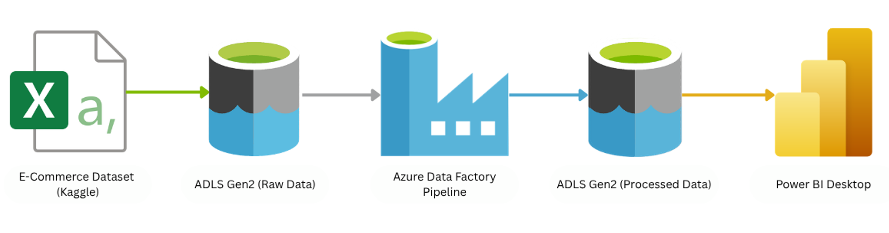
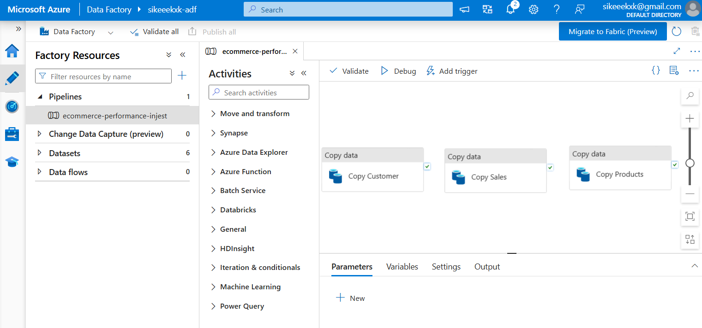
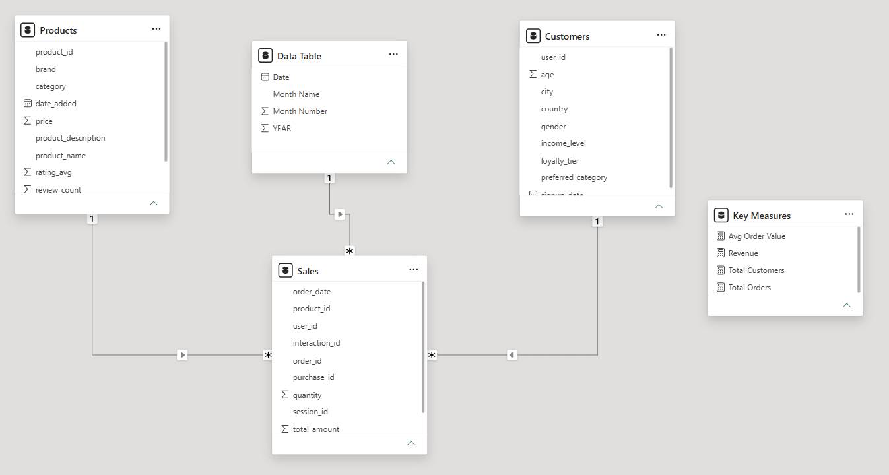
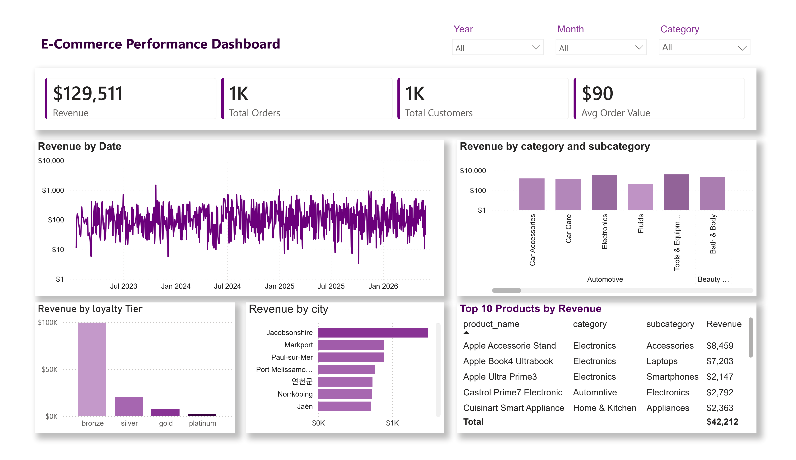

# End-to-End E-Commerce Data Pipeline & Analytics Dashboard

## OBJECTIVES
This project demonstrates an end-to-end data engineering pipeline using Microsoft Azure and Power BI. It ingests e-commerce sales data, orchestrates data movement using Azure Data Factory, stores the data in Azure Data Lake Storage Gen2 (ADLS Gen2), and visualizes business insights through an interactive Power BI dashboard.

## PROJECT GOAL & QUESTIONS:
A mid-size online retailer wants to monitor sales trends, customer behavior, and performance across product categories and customer segments using 3.5 years of relational e-commerce data (Jan 2023 - Jun 2026).

**Key Business Questions Answered:**
1. What is the total revenue?
2. How many orders were placed?
3. How many customers purchased?
4. Which category performs best?
5. Which city contributes the most revenue?
6. Which loyalty tier (Bronze, Silver, Gold, Platinum) drives the most sales?
7. Which products generate maximum revenue?
8. How does revenue trend over time?

## DATA SOURCES
The project uses selected CSV files from the **E-Commerce Product Intelligence Dataset** (Kaggle). The data was imported into Power BI and modeled as a star schema to support efficient analysis and reporting.

Dataset: [E-Commerce Product Intelligence Dataset](https://www.kaggle.com/datasets/anujsaha0123456789/e-commerce-product-intelligence-dataset)

File | Rows | Description |
| :--- | :--- | :--- |
| `customers.csv` | 10,000 | Customer profiles with demographics and loyalty tiers |
| `products.csv` | 1,000 | Product catalog with category hierarchy and pricing |
| `sales.csv` | 1,737 | Purchase order line items and transaction details |

## ARCHITECTURE

## TECHNOLOGIES USED
- **Azure Data Lake Storage Gen2** – Stores raw (input) and processed (output) data.
- **Azure Data Factory** – Orchestrates data ingestion and movement.
- **Power BI Desktop** – Performs data modeling, DAX calculations, and dashboard development.
- **Power Query** – Cleans and transforms the dataset.

## DATA PIPELINES WORKFLOW

**Ingestion:** Raw CSV files from Kaggle (Customers, Products, Sales) are uploaded to the `input` directory in Azure Data Lake.
**Orchestration:** An Azure Data Factory pipeline automatically copies the data from the `input` folder to the `output` folder.
**Storage:** The copied dataset is stored in the `output` directory and used as the data source for Power BI.

## DATA MODELING & TRANSFORMATION

The dataset was structured using a star schema for optimized querying. Data cleaning and relationship modeling were handled within Power Bi to ensure accurate calculation of KPI metrics.

## DASHBOARD AND ANALYTICS

The Power BI dashboard provides key executive insights, including:
* Total Revenue and Total Orders
* Average Order Value (AOV)
* Revenue trends over time
* Top performing products and cities
